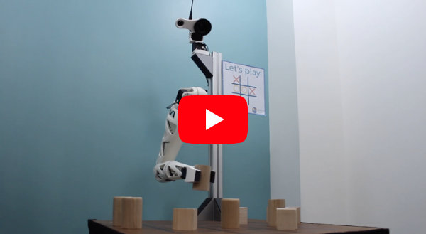

# Reachy the Bio-Inspired Robotic Arm

**Beautiful, Easy-to-use, Versatile, Open Source Human-size robotic arm for your robotic applications!**

## About
Reachy is a unique robot arm with a high level of mobility (7-Dofs). Different tool can be added on the arm's tip such as hook, gripper and 5 fingers hand.
You can learn more about this project on [its webpage](https://www.pollen-robotics.com/en/our-products/reachy/) and on youtube:
[](https://www.youtube.com/watch?v=wsCYkz-BHyA&list=PLoZg6JOJfhpCa1Sy3cM4FOFkcFUBElqBF&index=2)

Reachy is designed and produced by Pollen Robotics, we offer product design and custom developpement, you can learn more on our [website](https://www.pollen-robotics.com/).

## Open source
Reachy hardware and software are both open source and can be freely modified/custumized by the end user to fit its needs.

The software is built on top of the [Pypot library](https://github.com/poppy-project/pypot) and is distributed under LGPL Licence.

The hardware is made using OnShape under [Creative Commons BY-SA licence](https://creativecommons.org/licenses/by-sa/4.0/) licence and is accessible [here](https://cad.onshape.com/documents/66388ae9c63cef53d76acd77/w/68c2411483d5bc65c7f54234/e/581d46ba9b8ee98de9d636ee)

## Documentation
In this repository, there are multiple examples explaining how to use reachy.

- A Quickstart on how to plug and start reachy can be found [here](./doc/readme.md).
- You can learn more on the software architecture [here](./doc/reachy-software-presentation.ipynb).
- Several examples are available in the folder [applications](./applications/).

Those notebooks can be viewed directly on GitHub or can also be run locally to directly experiment with your robot. See the [jupyter documention](https://jupyter.org) for mor information on how to do that.

## Installation

Reachy's control library is written in Python (>=2.7 or >= 3.4) and works on Win/Mac/Linux. It allows for fast and simple control of your robotic arm. And also provides you example with more advanced features such as inverse kinematics, simulation, tracking, etc. It relies on the [pypot library](https://github.com/poppy-project/pypot) for the dynamixel motor communication.

On Raspberry-Pi you first need to install lapack/blas:

```
sudo apt install liblapack-dev gfortran libblas-dev
```

It can be installed from the source via pip.

```
git clone https://github.com/pollen-robotics/reachy.git
pip install -e ./reachy/software
