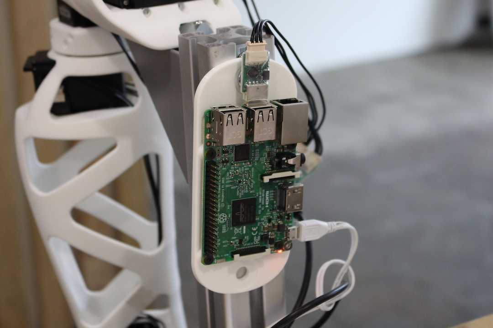

# Quickstart with Reachy

## Plug your Reachy

The first step to start your Reachy robot is to make sure the motors are powered using the dedicated 12V power supply. The usb dongle used to connect to the motors should also be plugged in the Raspberry Pi. You can record it to your local network using an ethernet cable. And finally, you also have to power the Raspberry Pi board using its adapter.

See the pictures below for details.

## Connect to the robot interface

Once the robot is started, you can connect to its web interface. You can directly access it on http://reachy.local/ (This uses the zeroconf protocol to resolve the hostname. It should directly works on Linux and OS-X but requires to install this on Windows: https://support.apple.com/kb/DL999 You can also directly use the robot's IP if you know it).

 This lets you to use the monitor interface, directly run Python code in your robot using Jupyter or use the visual language Snap.

 You can find an example of Python code to start making your robot move in Jupyter.

 

 ## FAQ & Troubleshooting

 * Most of the connection problem with the robot are due to broken or badly plugged motor wires. Make sure to check them when you have trouble controlling your robot.

 * Make sure to set the motor to not compliant before trying to move them! Otherwise they will simply do nothing.

 * You can find more information on the documentation of the poppy project: https://docs.poppy-project.org/
  Most code should also work for the Reachy robot.
