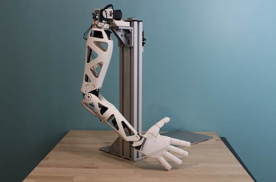
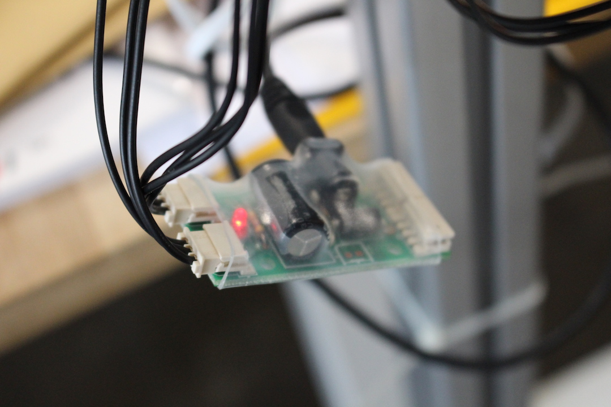
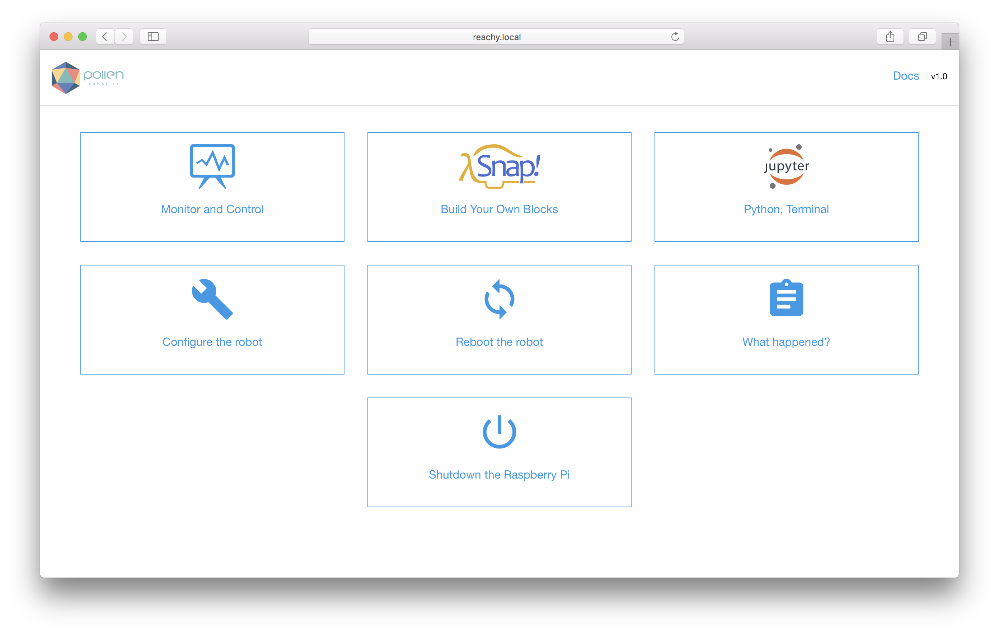
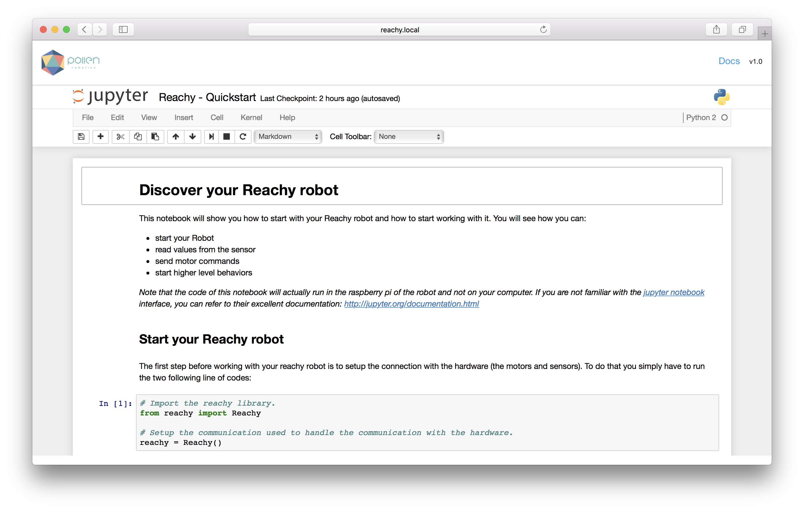

# Quickstart with Reachy

## Plug your Reachy

The first step to start your Reachy robot is to make sure the motors are powered using the dedicated 12V power supply. The usb dongle used to connect to the motors should be plugged to your computer or the Raspberry Pi.

See the pictures below for details.

Depending on the end-effector you are using, you may also need to plug it. For instance, also plug the dedicated USB if you are using the gripper with the force sensor.

## Software

The control libraries used for Reachy are all written in Python and can be directly found in this repo. A complete presentation can be found [here](./reachy-software-presentation.ipynb). You can also read the [Quickstart](./notebook/Reachy-Quickstart.ipynb) to directly jump in controlling reachy.

Most of the documentation can be found as jupyter notebook. Make sure to check [their documentation](https://jupyter.org) if you are unfamiliar with them. They are a really powerful way to document and let you experiment code.
You will find them in two main places:

* the basic ones for a general presentation can be found [here](./notebook).
* the specific ones with which are more applications oriented can be found [here](../applications)

## FAQ & Troubleshooting

* Most of the connection problem with the robot are due to broken or badly plugged motor wires. Make sure to check them when you have trouble controlling your robot.

* Make sure to set the motor to not compliant before trying to move them! Otherwise they will simply do nothing.

* You can find more information on the documentation of the poppy project: https://docs.poppy-project.org/
 Most code should also work for the Reachy robot.

## Appendix - Using the Raspberry-Pi webinterface

### Connect to the robot interface

Once the robot is started, you can connect to its web interface. You can directly access it on http://reachy.local/ (This uses the zeroconf protocol to resolve the hostname. It should directly works on Linux and OS-X but requires to install this on Windows: https://support.apple.com/kb/DL999 You can also directly use the robot's IP if you know it).

 This lets you to use the monitor interface, directly run Python code in your robot using Jupyter or use the visual language Snap.

 You can find an example of Python code to start making your robot move in Jupyter.

 
